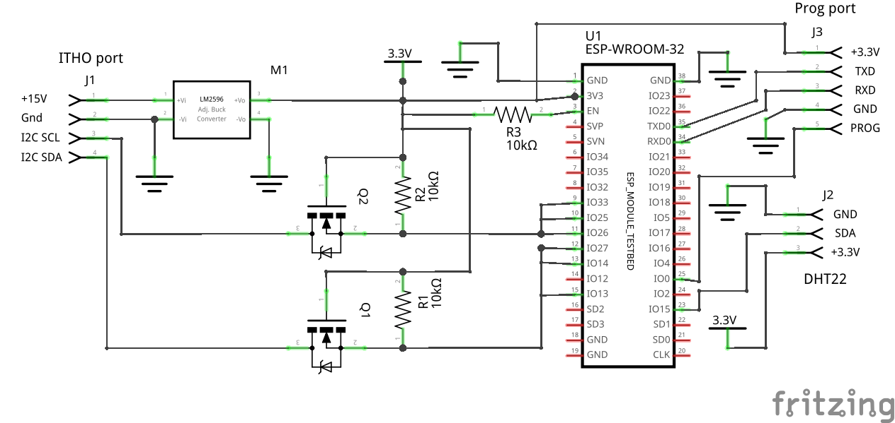

### RJ45 dianostic port pinout

| Pin |      |
| --- | ---- |
| 2   | SCL  |
| 3   | GND  |
| 4   | GND  |
| 5   | +15V |
| 7   | SDA  |

The SCL, SDA are I2C lines with a 5V pull-up (5,6K) connecting straight to the CPU on the Itho mainboard.

+15V can be used for power supply needs (appears to be good for at least 1A).

There is no +5V available, but is not needed due to the built-in pull-ups (the lines only need to be pulled down for a logical 0).

---

### GPIO Pin assignment

| GPIO | Desc            | Notes                                     |
| ---- | --------------- | ----------------------------------------- |
| 0    | Reset           | The ESP32 reset pin (inverted)            |
| 13   | I2C Sniffer SDA | Defined in [i2c_sniffer.h](i2c_sniffer.h) |
| 14   | I2C Slave SDA   | Defined in [i2c_slave.h](i2c_slave.h)     |
| 15   | DHT Data        | Defined in [dht.h](dht.h)                 |
| 25   | I2C Sniffer SCL |                                           |
| 26   | I2C Master SCL  | Defined in [i2c_master.h](i2c_master.h)   |
| 27   | I2C Master SDA  |                                           |
| 33   | I2C Slave SCL   |                                           |

The I2C pins were carefully chosen so that they can be wired into a "bus", as can be seen on the schematic:

---

### I2C message format

The Itho mainboard is an I2C master running at ~100kHz.  
Each packet has a checksum byte at the end, which is the negative sum of all other bytes.  
First byte is destination address (0x82 = Itho mainboard).  
Second byte is reply address (0x80 = dongle).

---

### Message `90 E0 04`: query device type

82 80 90 E0 04 00 8A

Example reply:

80 82 90 E0 01 12 00 01 00 03 12 0B 00 00 00 FF FF FF FF FF FF FF FF 00 62

03 = HRU, 12 0B = version/revision.

---

### Message `A4 00 04`: query status format

82 80 A4 00 04 00 56

Example reply:

80 82 A4 00 01 16 91 11 10 90 10 90 92 92 00 92 92 00 00 91 00 10 10 00 90 00 00 10 C8

A4 00 01 followed by number of data elements, followed by element formats (1 byte per element).

Data format (1 byte):

| Bit  | Description                        |
| ---- | ---------------------------------- |
| 7    | signed (1) / unsigned (0)          |
| 6..4 | size in bytes (2^n): 0=1, 1=2, 2=4 |
| 3..0 | decimal digits (divider 10^n)      |

---

### Message `A4 01 04`: query device status

82 80 A4 01 04 00 55

Example reply:

80 82 A4 01 01 25 00 00 03 9C 03 9E 03 98 03 EB 03 EB 09 09 09 8A 00 09 09 09 8A 00 00 0B B8 01 00 00 00 B1 79 00 00 00 00 10 95 9F

80 82 A4 01 01 followed by data size and data formatted according to the status format (see previous message).

The temperatures are the bytes 09 09 09 8A, or (0x0909 and 0x098A) 23.13 C en 24.42 C respectively (.01 values).

The first 00 00 is the ventilation level. It goes from 0 for position "1" to 03E8 (100.0) for level "3".

For the meaning of each data element refer to [Itho Data Labels.xlsx](Itho%20Data%20Labels.xlsx)

---

### Itho ecofan RFT 536-0124 (RF remote control) messages

Button 1:  
82 60 C1 01 01 11 (4b: msg timestamp) (4b: commander ID) (1b: command seq nr) 22 F1 03 00 02 04 (2b: seq) (1b: checksum)

Button 2:  
82 60 C1 01 01 11 (4b: msg timestamp) (4b: commander ID) (1b: command seq nr) 22 F1 03 00 03 04 (2b: seq) (1b: checksum)

Button 3:  
82 60 C1 01 01 11 (4b: msg timestamp) (4b: commander ID) (1b: command seq nr) 22 F1 03 00 04 04 (2b: seq) (1b: checksum)

Button 4 (1st press):  
82 60 C1 01 01 11 (4b: msg timestamp) (4b: commander ID) (1b: command seq nr) 22 F3 03 00 00 0A (2b: seq) (1b: checksum)

Button 4 (2nd press):  
82 60 C1 01 01 11 (4b: msg timestamp) (4b: commander ID) (1b: command seq nr) 22 F3 03 00 00 14 (2b: seq) (1b: checksum)

Button 4 (3rd press):  
82 60 C1 01 01 11 (4b: msg timestamp) (4b: commander ID) (1b: command seq nr) 22 F3 03 00 00 1E (2b: seq) (1b: checksum)

Register an RFT (press 1+4 or 2+3):  
82 60 C1 01 01 1A (4b: msg timestamp) (4b: commander ID) (1b: command seq nr) 1F C9 0C 00 22 F1 (3b: commander ID) 01 10 E0 (3b: commander
ID) (2b: seq) (1b: checksum)

Deregister an RFT (press 1+2+3+4):  
82 60 C1 01 01 14 (4b: msg timestamp) (4b: commander ID) (1b: command seq nr) 1F C9 06 00 1F C9 (3b: commander ID) (2b: seq) (1b: checksum)

Notes:

* Each command is repeated 3 times with a short interval
* Note sure if my interpretation of (4b: msg timestamp), (1b: command seq nr), (2b: seq) is correct, but they can all be `00`'s (at least for HRU
ecofan)
* (3b: commander ID) are the last 3 bytes of the ID (or maybe it's always 3 bytes and in the case of 4b prefixed with `16`)

...
